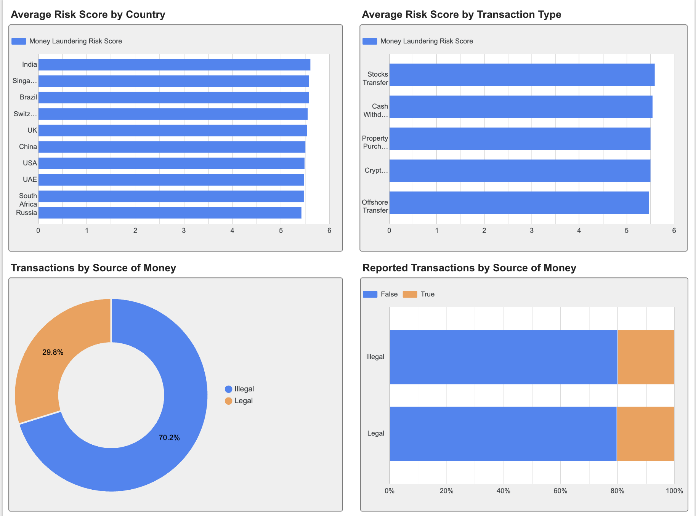

#AML Risk Analysis of Global Financial Transactions

##Project Overview

This project analyzes financial transactions to identify patterns associated with money laundering risk. The goal is to discover trends across transaction types, countries, industries, transaction amounts, sources of money, and other risk-related factors. The analysis was conducted using Python and Pandas, with visualizations created to highlight key findings and patterns in the data.

##Objectives

1. Analyze transaction patterns across transaction types, countries, and industries.
2. Examine transaction amounts and identify countries/industries with the highest financial activity.
3. Investigate factors associated with money laundering risk, including industry, country, transaction type, amount, and shell companies.
4. Compare legal and illegal sources of money and their relationship with risk scores and reported transactions.
5. Analyze temporal patterns in transaction volume and risk scores.

##Tools

Python
Pandas - data cleaning and analysis
Jupyter Notebook — exploratory data analysis
Looker Studio — interactive dashboard
GitHub — project documentation and version control

##Data cleaning

1. Converted Date of Transaction to datetime format.
2. Checked for missing values.
3. Checked for duplicate records.
4. Formatted Amount (USD) values for readability.
5. Checked data types.

##Exploratory Data Analysis

The analysis explored financial transaction patterns across transaction types, countries, industries, and sources of money.
Key areas of analysis included:
1. Transaction volume by transaction type
2. Transaction volume and total transaction amount by country
3. Total and average transaction amount by industry
4. Average money laundering risk score by country
5. Average money laundering risk score by transaction type
6. Average money laundering risk score by industry
7. Risk score comparison between legal and illegal sources of money
8. Relationship between transaction amount and money laundering risk score
9. Reported transactions by source of money
10. Number of shell companies involved and its relationship with risk score
11. Transaction trends by year and month

##Key Insights

1. Property Purchase was the most common transaction type, while Cryptocurrency was the least common.
2. China had the highest number of transactions and the highest total transaction amount. India had the highest average money laundering risk score among the analyzed countries.
3. Finance had the highest transaction volume and the highest total transaction amount. However, Arms Trade had the highest average transaction amount.
4. Illegal transactions accounted for the majority of transactions (70.17%). However, the average risk scores for illegal and legal sources were almost identical (5.53 vs. 5.52).
5. Transaction amount showed a very weak correlation with money laundering risk score, suggesting that larger transactions were not necessarily associated with higher risk.
6. Transaction volume was much higher in 2013 than in 2014. The average risk score varied slightly across months, with January showing the highest average risk score (5.66) and July the lowest (5.40).

##Dashboard

An interactive dashboard was created in Looker Studio to visualize key transaction and money laundering risk patterns.

###Overview

The first page provides a high-level overview of the dataset, including:
1. Total transactions
2. Total transaction amount
3. Average money laundering risk score
4. Illegal transactions
5. Transactions by type
6. Transactions by country
7. Total transaction amount by country
8. Total transaction amount by industry

Overview Dashboard.png

###Risk Analysis
The second page focuses on factors associated with money laundering risk, including:
1. Average risk score by country
2. Average risk score by transaction type
3. Average risk score by industry
4. Transaction amount vs. money laundering risk score

##Conclusion
This analysis explored global financial transactions to identify patterns related to money laundering risk. The results showed differences in transaction volume, transaction amounts, industries, countries, and time periods. However, several factors showed only weak differences in average risk scores. In particular, transaction amount had almost no linear relationship with the money laundering risk score, while legal and illegal sources of money had very similar average risk scores. 

Overall, the analysis provides useful descriptive insights into transaction patterns and risk indicators. However, further statistical analysis and additional variables would be required to identify strong predictors of money laundering risk.
